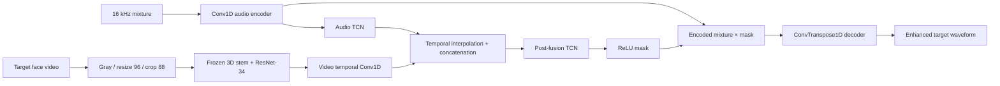

# Real-World AVSE Challenge Track 2 参赛与复现指南

> 更新日期：2026 年 6 月 25 日
>
> 官方网站：<https://real-world-avse.github.io/>
>
> 官方 baseline：<https://github.com/Real-World-AVSE/Baseline>

本文档面向准备参加 ISCSLP 2026 Real-World Audio-Visual Speech Enhancement Challenge Track 2 的开发者。仓库当前阶段负责复现官方 baseline 和建立可靠的实验入口，不宣称已经复现官方分数，也不提前合入未经数据验证的创新模型。

## 1. 赛题背景

语音增强或语音分离通常从混合音频中恢复目标语音：

```text
mixture = target speaker + interfering speaker + noise + reverberation
```

在低信噪比、强混响、多人同时讲话时，仅依赖音频很难判断应该保留哪位说话人。Audio-Visual Speech Enhancement（AVSE）额外输入目标说话人的脸部视频，通过嘴唇运动和语音内容之间的相关性约束输出目标：

```text
(混合波形, 目标说话人视频) -> 目标说话人的增强语音
```

传统 AVSE 基准多采用清晰视频和人工相加的混合语音，与真实部署仍有明显差距。挑战赛用两个互补赛道研究这一问题：

| 赛道 | 重点 | 主要困难 |
|---|---|---|
| Track 1 | 真实世界自然混合 | 自然重叠、噪声、混响、设备与距离变化 |
| Track 2 | 视觉退化鲁棒性 | 低清、遮挡、冻结、黑屏、丢帧、音画不同步、远场 |

Track 2 的关键问题不是“有视频是否比没视频好”，而是：当视觉信息不可靠时，模型能否识别其可靠程度，并避免错误视觉特征破坏音频分离结果？

## 2. 时间节点

官方页面当前公布的日期如下，均以 AoE 为准：

| 日期 | 事项 |
|---|---|
| 2026-06-22 | 开放注册 |
| 2026-06-23 | 发布 baseline、训练数据参考和 dev |
| 2026-07-12 | 发布 test，开放榜单；每队每天最多提交 3 次 |
| 2026-07-17 | 注册截止 |
| 2026-07-24 | 榜单冻结 |
| 2026-07-27 | 公布最终排名 |
| 2026-08-03 | 论文提交截止 |
| 2026-08-31 | 论文录用通知 |
| 2026-09-21 | Camera-ready 截止 |

注册表：<https://forms.gle/GYL1SHRpAdVPNanaA>。数据链接由主办方发送至注册邮箱；未收到时应联系 `realworldavse_iscslp2026@googlegroups.com`。

## 3. 官方数据

### 3.1 是否提供训练集

官方不指定训练集。允许使用公开数据、预训练模型和数据增强，但必须在最终论文中明确披露。官方提供：

- `dev`：用于本地开发和自评；
- `test`：2026 年 7 月 12 日发布，仅提供模型输入，参考答案由主办方保留。

因此正确的启动顺序是：**注册获取 dev、跑通 baseline、准备训练数据三件事并行推进**，而不是先盲目收集一个大型语料库。

### 3.2 mix 与 remix

每个 Track 2 片段会分别以 `s1` 和 `s2` 为目标运行一次：

- `mix`：真实录制的双人同时讲话，没有干净目标波形；
- `remix`：两个干净单人片段相加，dev 提供 `s1.wav` 和 `s2.wav`。

Track 2 dev 的官方规模为：

| 场景 | 片段数 | 目标评测项 |
|---|---:|---:|
| mix | 1,527 | 3,054 |
| remix | 1,098 | 2,196 |
| 合计 | 2,625 | 5,250 |

Track 2 复用 Track 1 数据并离线退化目标人视频，同时加入约 3 米距离的远场材料。dev 与 test 的说话人组完全不重叠，不能依赖记忆人物身份。

### 3.3 目录结构

```text
Real-World-AVSE/
└── track2/
    ├── dev/
    │   ├── mix/<clip_id>/
    │   │   ├── mix.wav
    │   │   ├── s1.mp4 / s2.mp4
    │   │   ├── s1.pkl / s2.pkl
    │   │   └── s1.txt / s2.txt
    │   ├── remix/<clip_id>/
    │   │   ├── mix.wav
    │   │   ├── s1.mp4 / s2.mp4
    │   │   ├── s1.pkl / s2.pkl
    │   │   ├── s1.txt / s2.txt
    │   │   └── s1.wav / s2.wav
    │   ├── mix_manifest.json
    │   └── remix_manifest.json
    └── test/
        └── ...
```

音频为 16 kHz 单声道；视频约为 25 fps。`.pkl` 是逐帧 68 点人脸关键点，可用于稳定裁剪。当前 baseline 的评测读取器默认会使用关键点做对齐，可用 `eval_real.py --no_align_face` 关闭并进行消融。

获取数据后首先运行：

```bash
python tools/check_track2_setup.py --data-root /path/to/Real-World-AVSE
```

## 4. Baseline：AV-ConvTasNet

模型输入和输出为：

```text
model(mixture[B, T], lip_frames[B, Tv, 88, 88]) -> enhanced[B, T]
```

整体数据流：



### 4.1 音频分支

- 原始波形时域建模，不先计算 STFT；
- 256 个编码滤波器，卷积核长度 40 samples，stride 20；
- bottleneck 256 通道；
- TCN 使用深度可分离膨胀卷积；
- 每个 repeat 含 8 个 block，dilation 从 1 到 128；
- 非因果模型，不以实时部署为目标。

### 4.2 视频分支

- 灰度人脸帧缩放至 `96×96`，训练随机裁剪、评测中心裁剪至 `88×88`；
- 3D stem + ResNet-34 唇读编码器，输出 512 维帧级特征；
- 视频编码器被冻结，并固定 BatchNorm 统计量；
- 之后用 5 层视频时序一维卷积映射到 256 维。

### 4.3 融合和输出

当前 Track 2 配置先运行 1 个 audio repeat，再把视频特征插值到音频特征长度并直接拼接，之后运行剩余 3 个 repeat。网络预测非负时域 mask，与混合音频编码特征相乘后解码为目标波形。

这种无条件融合是重要研究切入点：即使视频已经黑屏、冻结或错位，baseline 仍然按同样方式使用视觉特征。

### 4.4 训练配置

- 2 秒训练片段，16 kHz；
- Track 2 在线视觉退化概率 `degrade_prob=1.0`；
- 动态抽取两个不同说话人并相加；
- Adam，初始学习率 `1e-3`；
- `ReduceLROnPlateau`；
- 训练损失为负 SNR，验证损失为负 SI-SDR；
- 官方配置使用多 GPU DDP，最大 500 epochs，early-stop patience 20。

## 5. 视觉退化

baseline 的 Track 2 数据管线覆盖：

1. `FULL_MASK`：连续帧置零，模拟黑屏或帧缺失；
2. `OCCLUSION`：基于人脸关键点在嘴部叠加物体；
3. `LOW_RESOLUTION`：噪声、模糊和低质量；
4. `FRAME_FREEZE`：连续重复某帧；
5. `AV_DESYNC`：视频相对音频发生时间偏移。

只有目标人的视觉流被退化，音频不变。训练退化随机生成；验证和内部测试按样本索引固定随机种子，便于重复实验。

## 6. 评测指标

| 指标 | 场景 | 方向 | 含义 |
|---|---|---|---|
| SI-SDR | remix | 越高越好 | 波形级目标恢复质量 |
| PESQ | remix | 越高越好 | 感知语音质量 |
| STOI | remix | 越高越好 | 可懂度 |
| UTMOS | mix + remix | 越高越好 | 无参考主观质量预测 |
| DNSMOS | mix + remix | 越高越好 | 无参考信号、背景和整体质量 |
| CER | mix + remix | 越低越好 | 中文字符识别错误率 |
| Speaker similarity | mix + remix | 越高越好 | 是否保持目标说话人身份 |

`mix` 没有干净参考，因此不能本地计算 SI-SDR、PESQ、STOI。研究时不能只优化 SI-SDR：过强抑制可能提高部分信号指标，却损害 CER、自然度或说话人身份。

官方 README 公布的 Track 2 dev baseline 整体结果包括 remix SI-SDR 约 `-2.70 dB`、整体 CER 约 `0.915`。这些数值只用于复现参照；必须使用相同 commit、checkpoint、对齐设置和指标模型才能做严谨比较。

## 7. 环境和 baseline 复现

### 7.1 安装

官方脚本面向 Linux/集群环境，创建 Python 3.11、PyTorch 2.7.1/cu126 的 `real-avse` Conda 环境：

```bash
bash install.sh
conda activate real-avse
bash download_models.sh
python tools/check_track2_setup.py --check-env
```

`download_models.sh` 会准备评测模型。若从头训练，还必须按官方 README 手动下载约 259 MiB 的唇读 backbone：

```text
video_pretrain/frcnn_128_512.backbone.pth.tar
```

评测模型统一保存在 Git 仓库外：

```text
<EVAL_ASSET_ROOT>/
├── utmosv2/                 # UTMOSv2 fold0 权重
├── huggingface/             # facebook/wav2vec2-base 离线缓存
├── dnsmos/                  # 3 个 DNSMOS ONNX
├── funasr/
│   ├── Fun-ASR-Nano-2512/
│   └── fsmn-vad/
└── wespeaker/cnceleb-resnet34-LM/
```

本项目当前服务器使用的逻辑根目录是
`/home/avse/avse-assets/evaluation`。文档和提交中只记录
`EVAL_ASSET_ROOT`，避免把个人绝对路径硬编码进代码：

```bash
export EVAL_ASSET_ROOT=/external/path/to/avse-assets/evaluation
HF_ENDPOINT=https://hf-mirror.com bash tools/download_eval_assets.sh
python tools/check_track2_setup.py --eval-asset-root "$EVAL_ASSET_ROOT"
```

`tools/download_eval_assets.sh` 只依赖 Bash、`aria2c` 和网络，不需要先安装
Python/Conda；因此可以在 dev 到手前完成全部评测模型准备。

`enroll_dev.pt` 不能提前下载或凭空生成；拿到 dev 后使用其中干净的
`remix/s1.wav`、`s2.wav` 与已准备好的 WeSpeaker 权重生成，并保存到
仓库外：

```bash
python build_enrollment.py \
  --data_root "$DATA_ROOT" --track track2 --split dev \
  --wespeaker_ckpt \
  "$EVAL_ASSET_ROOT/wespeaker/cnceleb-resnet34-LM/model_5.pt" \
  --out "$ENROLL_CKPT"
```

### 7.2 最小推理

Track 2 模型页面公开可见，但模型文件采用 gated access。当前页面要求登录账号并同意共享联系信息，接受条件后才能下载 `config.json` 和 `model.safetensors`。仅能看到 model card 不等于已经获得文件访问权；不要把 `HF_TOKEN` 写入仓库或聊天。数据和 checkpoint 访问准备后：

```bash
DATA_ROOT=/path/to/Real-World-AVSE \
GPU=0 \
bash scripts/smoke_track2.sh
```

脚本对 `mix` 和 `remix` 各取一个片段，关闭所有指标，仅验证数据读取、MP4/关键点处理、checkpoint 加载、模型前向和输出目录格式。

也可以直接使用 Hugging Face repo id。当前 `eval_real.py` 仍会读取
`--conf_dir` 以获得采样率和人脸尺寸，因此在本仓库中应显式传入 Track 2
配置：

```bash
python eval_real.py \
  --conf_dir configs/track2_av_convtasnet.yml \
  --ckpt JusperLee/Real-World-AVSE-Baseline-Track2 \
  --data_root "$DATA_ROOT" \
  --track track2 --scene both --split dev \
  --metrics none --mode enhance --save_dir enhanced_out/smoke-hf \
  --gpus 0 --limit 1
```

Hugging Face checkpoint 已包含训练后的 ResNet 视频编码器权重。只有从头
训练新模型时才需要
`video_pretrain/frcnn_128_512.backbone.pth.tar`；使用发布 checkpoint
进行推理或继续加载权重时不需要它。

团队已下载并校验 Track 2 checkpoint，来源 revision 为：

```text
3777a458d13e8dc98877f69e542d6a8a7441835b
```

| 文件 | 大小 | SHA256 |
|---|---:|---|
| `config.json` | 279 bytes | `de1819318f7c3fb79914314475ab4b223973af9104d42600e533cdb557bcf5f8` |
| `model.safetensors` | 100,176,860 bytes | `600d1632346e9b85e64f2842000f41d2cdb9f6b1afca8011c5decdc5ce9e78c1` |

这两个文件应放在 Git 仓库外的同一个目录中，并把目录作为 `--ckpt`
传入：

```bash
export TRACK2_MODEL_DIR=/external/path/to/Real-World-AVSE-Baseline-Track2

python eval_real.py \
  --conf_dir configs/track2_av_convtasnet.yml \
  --ckpt "$TRACK2_MODEL_DIR" \
  --data_root "$DATA_ROOT" \
  --track track2 --scene both --split dev \
  --metrics none --mode enhance --save_dir enhanced_out/smoke-local \
  --gpus 0 --limit 1
```

不要把 `model.safetensors` 加入 Git，也不要使用 `git add -f` 绕过保护。

### 7.3 完整 dev 评测

```bash
DATA_ROOT=/path/to/Real-World-AVSE \
EVAL_ASSET_ROOT=/external/path/to/avse-assets/evaluation \
ENROLL_CKPT=pretrained/enroll_dev.pt \
bash run_eval_real.sh \
  "$TRACK2_MODEL_DIR" \
  track2 both all 0,1,2,3 "" both
```

完整 Track 2 dev 应覆盖 5,250 个目标评测项。建议把增强和评分拆开执行，便于修改指标而不重复昂贵推理。

注意：`eval_real.py` 的 `--mode` 默认值是 `both`，但
`run_eval_real.sh` 的第七个位置参数默认值是 `eval`。上面的 `"" both`
中，空字符串表示不设置 `LIMIT`，`both` 表示确实执行增强和评分。如果
省略它，wrapper 只会读取 `SAVE_DIR` 中已经存在的增强 wav 进行评分。

wrapper 还会强制 Hugging Face、Transformers 和 ModelScope 离线。
`download_models.sh` 会缓存评测指标模型，但当前不会下载 gated 的 Track 2
baseline checkpoint。正式运行优先使用上面已经校验的本地模型目录；也可
在联网环境预热并复制经过校验的 Hugging Face cache。

## 8. 训练数据

baseline 训练流程使用 VoxCeleb2 风格的干净单人音视频和预生成混合目录。需要注意：

- `DataPreProcess/process_vox2.py` 只生成 JSON manifest；
- 它不会下载 VoxCeleb2；
- 它也不会自动生成人脸裁剪或 `mix/s1/s2` 波形；
- VoxCeleb2 官方页面当前已停止公开音视频下载，必须确认已有副本的合法来源。

可考虑的公开替代或补充来源：

- AVSpeech：大规模单人音视频片段；
- LRS2/LRS3：以唇读和语音识别为主的音视频语料，须遵守其申请与许可；
- DNS Challenge 噪声和 RIR：加入真实噪声、混响和远场条件。

训练/验证划分必须按说话人隔离。官方 dev 应优先作为最终开发评测集，不应直接混入训练，以免过拟合仅有的三个 dev 说话人组。

检查 baseline 训练资产：

```bash
python tools/check_track2_setup.py --check-training-assets
```

## 9. 提交格式

```text
submission/
└── track2/
    └── test/
        ├── mix/<clip_id>/s1.wav
        ├── mix/<clip_id>/s2.wav
        ├── remix/<clip_id>/s1.wav
        └── remix/<clip_id>/s2.wav
```

要求：

- 每个片段同时提交 `s1.wav` 和 `s2.wav`；
- 16 kHz、单声道 WAV；
- 输出长度与输入 mixture 一致；
- 不修改 clip id 或目标标签；
- 不把 test 数据、模型权重或提交音频加入 Git。

`eval_real.py --mode enhance --save_dir <submission>` 会直接生成兼容布局。

## 10. 常见陷阱

- README 与代码可能随 upstream 更新；实验必须记录 commit SHA。
- 当前评测默认启用 `.pkl` 关键点对齐，关闭对齐会改变结果。
- dev 和 test 说话人不重叠，dev enrollment 不能直接用于 test。
- Track 2 是 Track 1 退化版本加远场数据，不是一个小型独立语料。
- 指标模型较多，首次下载和缓存需要联网；计算集群可以随后离线运行。
- 官方 Hugging Face checkpoint 是 gated 模型：能看到页面和 model card
  不代表能下载文件；需登录、接受联系信息共享条件并验证实际下载。
- Hugging Face model card 当前给出的 `eval_real.py` 示例没有显式传
  `--conf_dir`；在本仓库当前版本中应补上
  `configs/track2_av_convtasnet.yml`。
- `run_eval_real.sh` 默认 `MODE=eval`，省略第七个位置参数不会运行模型。
- `run_eval_real.sh` 强制离线，而 `download_models.sh` 当前不下载 AVSE
  baseline checkpoint；首次加载必须先在联网环境完成并复用同一缓存。
- 全量指标可能比模型推理更慢，应使用多 GPU 分片和合理 CPU 线程数。
- `.gitignore` 已排除数据、checkpoint、增强音频和实验目录，不要用 `git add -f` 绕过保护。

## 11. 后续研究路线

第一优先方向是**视觉可靠性感知融合**：

1. 在视频编码器后预测逐帧或逐片段可靠性；
2. 利用黑屏比例、模糊度、帧间变化、关键点有效率和视频 embedding；
3. 用可靠性门控替代无条件拼接；
4. 加入完全无视频样本，形成明确的 audio-only fallback；
5. 对 clean/degraded 两种视觉输入增加输出或特征一致性约束；
6. 再研究显式 AV offset 估计和局部时间对齐。

建议消融顺序：

```text
official baseline
  -> stronger degradation curriculum
  -> reliability gating
  -> modality dropout / audio-only fallback
  -> clean-degraded consistency
  -> explicit AV synchronization
```

每一步都应按退化类型和严重度分别报告结果，并同时观察 SI-SDR、质量、CER 和 speaker similarity。创新模型应在独立分支和 PR 中开发，避免 baseline 复现结果与研究改动混在一起。

## 12. 当前仓库的验收标准

在获取 dev 前：

- 官方 baseline 历史完整保留；
- 环境、数据和训练资产检查器可运行；
- smoke 脚本参数和输出布局明确；
- 不提交任何大型数据或权重。

获取 dev 后：

- 数据检查确认 Track 2 dev 为 1,527 个 mix 和 1,098 个 remix；
- smoke test 成功；
- 完整推理覆盖 5,250 个目标；
- 复现结果与官方结果处于合理误差范围；
- 将 checkpoint、commit、对齐选项和指标缓存版本写入实验记录。

## 参考链接

- Challenge：<https://real-world-avse.github.io/>
- Official baseline：<https://github.com/Real-World-AVSE/Baseline>
- Track 2 checkpoint：<https://huggingface.co/JusperLee/Real-World-AVSE-Baseline-Track2>
- VoxCeleb2：<https://www.robots.ox.ac.uk/~vgg/data/voxceleb/vox2.html>
- AVSpeech：<https://looking-to-listen.github.io/avspeech/>
- DNS Challenge：<https://github.com/microsoft/DNS-Challenge>
